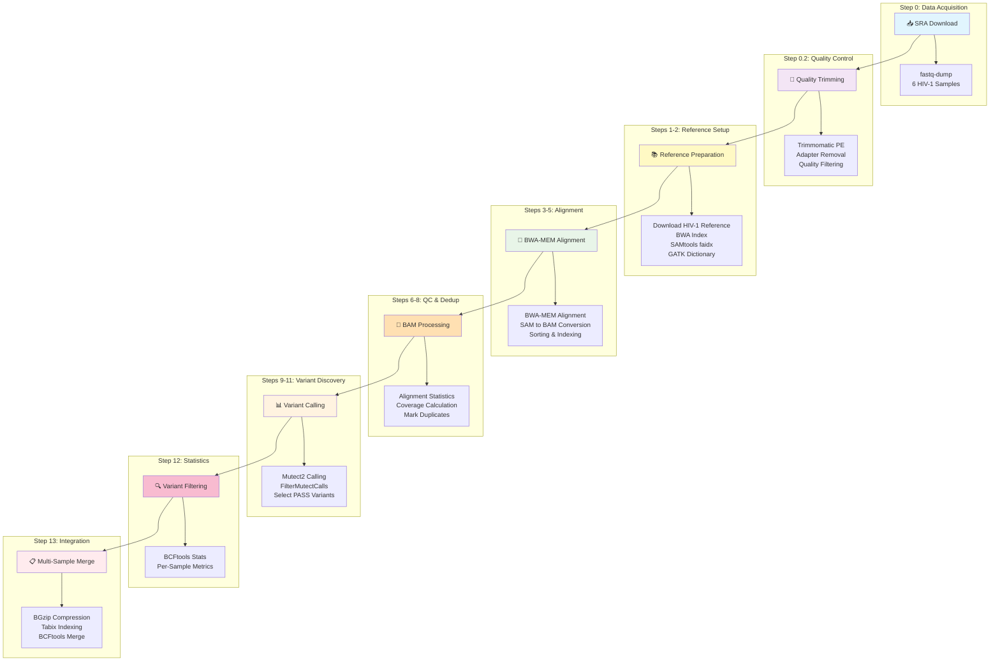

# HIV-1 Viral Variant Calling Pipeline

A comprehensive bioinformatics pipeline for calling variants in HIV-1 genomes using BWA-MEM alignment and GATK Mutect2 variant calling. This pipeline processes multiple samples simultaneously, including quality control, trimming, alignment, duplicate marking, variant calling, and multi-sample merging.

## Overview

This pipeline processes paired-end Illumina sequencing data to identify variants in HIV-1 genomes across multiple samples. It automatically downloads data from SRA, performs quality control and trimming, aligns reads using BWA-MEM, calls variants using GATK Mutect2 (optimized for somatic/viral variants), and merges results across all samples.

## Features

- **Automated SRA data download** using fastq-dump
- **Quality trimming** with Trimmomatic
- **Reference genome download** from NCBI (HIV-1 NC_001802.1)
- **BWA-MEM alignment** with proper read group assignment
- **Duplicate marking** with GATK MarkDuplicates
- **GATK Mutect2 variant calling** optimized for viral sequences
- **Variant filtering** with FilterMutectCalls
- **Multi-sample variant merging** with BCFtools
- **Comprehensive statistics** for alignment and variants
- **Coverage analysis** across all samples

## Pipeline Workflow



## Prerequisites

### Required Tools

Make sure the following tools are installed and available in your PATH:

| Tool | Version | Purpose | Installation Link |
|------|---------|---------|-------------------|
| [SRA Toolkit](https://github.com/ncbi/sra-tools) | ≥2.10 | Download SRA data | [GitHub](https://github.com/ncbi/sra-tools) |
| [Trimmomatic](http://www.usadellab.org/cms/?page=trimmomatic) | ≥0.39 | Read trimming | [Website](http://www.usadellab.org/cms/?page=trimmomatic) |
| [BWA](https://github.com/lh3/bwa) | ≥0.7.17 | Read alignment | [GitHub](https://github.com/lh3/bwa) |
| [SAMtools](https://www.htslib.org/) | ≥1.10 | SAM/BAM processing | [Website](https://www.htslib.org/) |
| [GATK](https://gatk.broadinstitute.org/) | ≥4.2 | Variant calling | [Broad Institute](https://gatk.broadinstitute.org/) |
| [BCFtools](https://www.htslib.org/) | ≥1.10 | VCF processing & merging | [Website](https://www.htslib.org/) |
| [Tabix](https://www.htslib.org/) | ≥1.10 | VCF indexing | [Website](https://www.htslib.org/) |
| [wget](https://www.gnu.org/software/wget/) | Any | Download reference | Pre-installed on most systems |

### Additional Requirements

- **Trimmomatic adapter file**: `TruSeq3-PE.fa` (usually included with Trimmomatic installation)

### System Requirements

- **Operating System**: Linux/Unix (tested on Ubuntu 18.04+)
- **Memory**: Minimum 16GB RAM (32GB recommended for 12 threads)
- **Storage**: At least 50GB free space for multiple samples and intermediate files
- **CPU**: Multi-core processor (pipeline uses 12 threads by default)
- **Network**: Stable internet connection for downloading SRA data and reference genome

## Installation

### Using Conda (Recommended)

```bash
# Create a new conda environment
conda create -n hiv-variants python=3.8

# Activate the environment
conda activate hiv-variants

# Install required tools
conda install -c bioconda bwa samtools gatk4 bcftools trimmomatic sra-tools

# Install additional dependencies
conda install -c conda-forge wget tabix
```

### Manual Installation

Alternatively, install each tool manually following the links provided in the prerequisites table.

## Usage

### Basic Usage

1. **Clone this repository:**
   ```bash
   git clone https://github.com/MadhuramDidwani45/NGS-Viral-Variants-Pipeline.git
   cd NGS-Viral-Variants-Pipeline
   ```

2. **Make the script executable:**
   ```bash
   chmod +x variant_calling.sh
   ```

3. **Run the pipeline:**
   ```bash
   ./variant_calling.sh
   ```

### Customization

#### Modify Sample List

Edit the `SAMPLES` array in the script:

```bash
# Change these SRA accessions to your samples
SAMPLES=(SRR33784444 SRR33784445 SRR33784446 SRR33784447 SRR33784448 SRR33784449)
```

#### Adjust Thread Count

Modify the `THREADS` variable based on your CPU:

```bash
# Change from default 12 to your preferred number
THREADS=8
```

#### Change Reference Genome

To use a different viral reference:

```bash
# Modify the reference download URL
wget --quiet --show-progress \
    --output-document=${REFERENCE} \
    "https://eutils.ncbi.nlm.nih.gov/entrez/eutils/efetch.fcgi?db=nuccore&id=YOUR_ACCESSION&rettype=fasta"
```

#### Modify Trimmomatic Parameters

Adjust quality trimming settings:

```bash
trimmomatic PE -threads ${THREADS} \
    # ... input/output files ...
    ILLUMINACLIP:TruSeq3-PE.fa:2:30:10 \
    LEADING:3 \              # Leading quality threshold
    TRAILING:3 \             # Trailing quality threshold
    SLIDINGWINDOW:4:15 \     # Sliding window: window_size:quality
    MINLEN:36                # Minimum read length
```

## Pipeline Steps

| Step | Description | Output |
|------|-------------|--------|
| **0** | Create directory structure | `raw_fastq/`, `trimmed_reads/`, `bam_files/`, `vcf_files/`, `reports/` |
| **0.1** | Download FASTQ files from SRA | `raw_fastq/*.fastq.gz` |
| **0.2** | Trim reads with Trimmomatic | `trimmed_reads/*_paired.fastq.gz` |
| **1** | Download HIV-1 reference genome | `reference.fa` |
| **2** | Index reference genome | `reference.fa.{bwt,pac,ann,amb,sa}`, `reference.fa.fai`, `reference.dict` |
| **3** | Align reads with BWA-MEM | `bam_files/*_aligned.sam` |
| **4** | Convert SAM to BAM and sort | `bam_files/*_sorted.bam` |
| **5** | Index BAM files | `bam_files/*_sorted.bam.bai` |
| **6** | Generate alignment statistics | `reports/*_alignment_stats.txt` |
| **7** | Calculate coverage | `reports/*_coverage.txt`, `reports/*_coverage_summary.txt` |
| **8** | Mark duplicates | `bam_files/*_dedup.bam`, `reports/*_dup_metrics.txt` |
| **9** | Call variants with Mutect2 | `vcf_files/*_raw.vcf` |
| **10** | Filter variants | `vcf_files/*_filtered.vcf` |
| **11** | Select PASS variants only | `vcf_files/*_pass.vcf` |
| **12** | Generate variant statistics | `reports/*_variant_stats.txt` |
| **13** | Merge all samples | `vcf_files/merged_all_samples.vcf` |

## Output Files

### BAM Files Directory (`bam_files/`)
- `*_sorted.bam` - Aligned and sorted reads
- `*_dedup.bam` - Deduplicated reads with proper read groups
- `*.bai` - BAM index files

### VCF Files Directory (`vcf_files/`)
- `*_raw.vcf` - Raw variant calls from Mutect2
- `*_filtered.vcf` - Filtered variants with quality annotations
- `*_pass.vcf` - High-confidence PASS variants only
- `*_pass.vcf.gz` - Compressed VCF files
- `*_pass.vcf.gz.tbi` - Tabix index files
- `merged_all_samples.vcf` - Merged variants across all samples

### Reports Directory (`reports/`)
- `*_alignment_stats.txt` - SAMtools flagstat output
- `*_coverage.txt` - Per-base coverage data
- `*_coverage_summary.txt` - Average coverage statistics
- `*_dup_metrics.txt` - Duplicate marking metrics
- `*_variant_stats.txt` - BCFtools variant statistics

### Trimmed Reads Directory (`trimmed_reads/`)
- `*_1_paired.fastq.gz` - Trimmed forward reads (paired)
- `*_2_paired.fastq.gz` - Trimmed reverse reads (paired)
- `*_1_unpaired.fastq.gz` - Unpaired forward reads
- `*_2_unpaired.fastq.gz` - Unpaired reverse reads

## Quality Control Parameters

### Trimmomatic Settings
- **ILLUMINACLIP**: TruSeq3-PE.fa:2:30:10 (adapter removal)
- **LEADING**: 3 (cut bases below quality 3 from start)
- **TRAILING**: 3 (cut bases below quality 3 from end)
- **SLIDINGWINDOW**: 4:15 (scan with 4-base window, cut when average quality < 15)
- **MINLEN**: 36 (drop reads below 36 bases)

### BWA-MEM Alignment
- **Threads**: 12 (configurable via `THREADS` variable)
- **-M flag**: Mark shorter split hits as secondary for Picard compatibility
- **Read groups**: Properly assigned for GATK compatibility

### GATK Mutect2 Parameters
- **Native pair-HMM threads**: 12 (parallel processing)
- **Max reads per alignment start**: 0 (unlimited, important for viral sequencing)
- **Min base quality score**: 20
- **Callable depth**: 10 (minimum depth to call variants)

### Variant Filtering
- Automatic filtering via `FilterMutectCalls`
- PASS variants selected with `SelectVariants --exclude-filtered true`

## Interpreting Results

### Alignment Statistics
Check `reports/*_alignment_stats.txt` for:
- Total reads
- Mapped reads percentage
- Properly paired reads
- Duplicate rate

### Coverage Analysis
Review `reports/*_coverage_summary.txt` for average coverage across the genome. HIV-1 typically requires 100x+ coverage for reliable variant calling.

### Variant Statistics
Examine `reports/*_variant_stats.txt` for:
- Total number of SNPs and indels
- Transition/transversion ratio
- Variant quality distributions

### Merged VCF
The `merged_all_samples.vcf` file contains variants present across your sample cohort, useful for:
- Population-level variant analysis
- Identifying shared mutations
- Drug resistance mutation tracking

## Troubleshooting

### Common Issues

1. **SRA download fails**: 
   - Check internet connection
   - Verify SRA accession numbers are correct
   - Try running `vdb-config --interactive` to configure SRA toolkit

2. **Out of memory errors**: 
   - Reduce `THREADS` variable
   - Process fewer samples at once
   - Increase system RAM

3. **Trimmomatic adapter file not found**:
   - Locate TruSeq3-PE.fa file: `find / -name "TruSeq3-PE.fa" 2>/dev/null`
   - Update path in script or copy file to working directory

4. **GATK errors**:
   - Ensure Java is installed (GATK requires Java 8+)
   - Check GATK installation: `gatk --version`

5. **Permission errors**: 
   - Ensure write permissions in working directory
   - Check disk space: `df -h`

### Performance Tips

- **Use SSD storage** for faster I/O operations
- **Adjust thread count** based on CPU cores: typically use 75% of available cores
- **Process samples in batches** if system resources are limited
- **Monitor resources** with `htop` or `top` during execution

## Pipeline Runtime

Approximate runtime for 6 samples (varies based on data size and system):
- SRA download: 10-30 minutes per sample
- Trimming: 5-10 minutes per sample
- Alignment: 15-30 minutes per sample
- Variant calling: 10-20 minutes per sample
- **Total**: ~3-6 hours for all 6 samples

## Contributing

Contributions are welcome! Please:

1. Fork the repository
2. Create a feature branch (`git checkout -b feature/improvement`)
3. Commit your changes (`git commit -m 'Add improvement'`)
4. Push to the branch (`git push origin feature/improvement`)
5. Open a Pull Request

## License

This project is licensed under the MIT License - see the [LICENSE](LICENSE) file for details.

## Citation

If you use this pipeline in your research, please cite the relevant tools:

- **BWA**: Li H. and Durbin R. (2009) Fast and accurate short read alignment with Burrows-Wheeler Transform. *Bioinformatics*, 25:1754-60. [PMID: 19451168]

- **GATK**: McKenna A, et al. (2010) The Genome Analysis Toolkit: a MapReduce framework for analyzing next-generation DNA sequencing data. *Genome Research*, 20:1297-303. [PMID: 20644199]

- **SAMtools**: Li H., et al. (2009) The Sequence Alignment/Map format and SAMtools. *Bioinformatics*, 25:2078-9. [PMID: 19505943]

- **Trimmomatic**: Bolger AM, et al. (2014) Trimmomatic: a flexible trimmer for Illumina sequence data. *Bioinformatics*, 30:2114-20. [PMID: 24695404]

- **BCFtools**: Danecek P, et al. (2021) Twelve years of SAMtools and BCFtools. *GigaScience*, 10:giab008. [PMID: 33590861]

## Support

For questions or issues:
- Open an [issue](https://github.com/MadhuramDidwani45/NGS-Viral-Variants-Pipeline/issues) on GitHub
- Check the [troubleshooting](#troubleshooting) section
- Review tool-specific documentation linked in the prerequisites table

## Acknowledgments

This pipeline was developed for HIV-1 variant analysis and is optimized for viral genome sequencing data. Special thanks to the developers of all the open-source bioinformatics tools used in this pipeline.

## Changelog

### v2.0.0 (Current)
- Multi-sample support for 6 HIV-1 samples
- Automated SRA data download
- Trimmomatic quality trimming integration
- GATK Mutect2 for variant calling (optimized for viral sequences)
- Multi-sample VCF merging with BCFtools
- Comprehensive coverage and alignment statistics
- Duplicate marking with GATK MarkDuplicates

### v1.0.0
- Initial release with single-sample support
- BWA-MEM alignment
- Basic GATK variant calling
