# Viral Variant Calling Pipeline

A comprehensive bioinformatics pipeline for calling variants in viral genomes using BWA-MEM alignment and GATK variant calling tools. This pipeline is optimized for viral sequences and includes quality control, trimming, alignment, variant calling, and consensus sequence generation.

## Overview

This pipeline processes paired-end Illumina sequencing data to identify variants in viral genomes. It downloads reference genomes from NCBI, performs quality control and trimming, aligns reads using BWA-MEM, and calls variants using GATK with viral-specific parameters.

## Features

- **Annotated reference genome download** from NCBI
- **Quality control** with FastQC (before and after trimming)
- **Read trimming** with Trimmomatic
- **BWA-MEM alignment** optimized for viral sequences
- **GATK variant calling** with viral-specific parameters
- **Variant filtering** and quality assessment
- **Consensus sequence generation**
- **Coverage analysis and statistics**
- **Comprehensive logging** with timestamps

  
## Pipeline Workflow

```mermaid
flowchart LR
    A[📥 Data Input] --> B[🔧 Preprocessing]
    B --> C[🧬 Alignment]
    C --> D[📊 Variant Calling]
    D --> E[📋 Results]
    
    subgraph " "
        A1[Reference Genome<br/>SRA Data] 
        A --> A1
    end
    
    subgraph " "
        B1[Quality Control<br/>Read Trimming<br/>FastQC Reports]
        B --> B1
    end
    
    subgraph " "
        C1[BWA-MEM Alignment<br/>BAM Processing<br/>Duplicate Removal]
        C --> C1
    end
    
    subgraph " "
        D1[GATK HaplotypeCaller<br/>Variant Filtering<br/>Quality Assessment]
        D --> D1
    end
    
    subgraph " "
        E1[VCF Files<br/>Consensus Sequence<br/>Coverage Statistics<br/>Summary Report]
        E --> E1
    end
    
    style A fill:#e1f5fe
    style B fill:#f3e5f5
    style C fill:#e8f5e8
    style D fill:#fff3e0
    style E fill:#ffebee
```



## Prerequisites

### Required Tools

Make sure the following tools are installed and available in your PATH:

| Tool | Version | Purpose | Installation Link |
|------|---------|---------|-------------------|
| [BWA](https://github.com/lh3/bwa) | ≥0.7.17 | Read alignment | [GitHub](https://github.com/lh3/bwa) |
| [SAMtools](https://www.htslib.org/) | ≥1.10 | SAM/BAM processing | [Website](https://www.htslib.org/) |
| [GATK](https://gatk.broadinstitute.org/) | ≥4.2 | Variant calling | [Broad Institute](https://gatk.broadinstitute.org/) |
| [BCFtools](https://www.htslib.org/) | ≥1.10 | VCF processing | [Website](https://www.htslib.org/) |
| [Trimmomatic](http://www.usadellab.org/cms/?page=trimmomatic) | ≥0.39 | Read trimming | [Website](http://www.usadellab.org/cms/?page=trimmomatic) |
| [FastQC](https://www.bioinformatics.babraham.ac.uk/projects/fastqc/) | ≥0.11 | Quality control | [Website](https://www.bioinformatics.babraham.ac.uk/projects/fastqc/) |
| [SRA Toolkit](https://github.com/ncbi/sra-tools) | ≥2.10 | SRA data download | [GitHub](https://github.com/ncbi/sra-tools) |

### System Requirements

- **Operating System**: Linux/Unix (tested on Ubuntu 18.04+)
- **Memory**: Minimum 8GB RAM (16GB recommended)
- **Storage**: At least 10GB free space for intermediate files
- **CPU**: Multi-core processor recommended (pipeline uses 4 threads by default)

## Installation

### Using Conda (Recommended)

```bash
# Create a new conda environment
conda create -n viral-variants python=3.8

# Activate the environment
conda activate viral-variants

# Install required tools
conda install -c bioconda bwa samtools gatk4 bcftools trimmomatic fastqc sra-tools

# Install additional dependencies
conda install -c conda-forge wget
```

### Manual Installation

Alternatively, install each tool manually following the links provided in the prerequisites table.

## Usage

### Basic Usage

1. **Clone this repository:**
   ```bash
   git clone https://github.com/MadhuramDidwani45/NGS-Viral-Variants-Pipeline.git
   cd viral-variant-calling
   ```

2. **Make the script executable:**
   ```bash
   chmod +x variant_calling_pipeline.sh
   ```

3. **Run the pipeline:**
   ```bash
   ./variant_calling_pipeline.sh
   ```

### Customization

The pipeline currently processes SRR33784444 with reference NC_001802.1. To analyze different data:

1. **Modify the SRA accession number:**
   ```bash
   # Change this line in the script
   prefetch SRR33784444 --progress
   # To your desired SRA accession
   prefetch YOUR_SRA_ID --progress
   ```

2. **Change the reference genome:**
   ```bash
   # Modify the reference URL
   wget --quiet --show-progress \
        --output-document=reference.fa \
        "https://eutils.ncbi.nlm.nih.gov/entrez/eutils/efetch.fcgi?db=nuccore&id=YOUR_REFERENCE_ID&rettype=fasta"
   ```

3. **Adjust parameters:**
   - **Thread count**: Modify `-t 4` in BWA-MEM command
   - **Quality thresholds**: Adjust GATK filtering parameters
   - **Trimming settings**: Modify Trimmomatic parameters


## Output Files

| File | Description |
|------|-------------|
| `sorted.bam` | Aligned and sorted reads |
| `unique_reads.bam` | Deduplicated reads with proper read groups |
| `output.vcf` | Raw variant calls |
| `filtered_output.vcf` | Filtered variants with quality annotations |
| `high_confidence_variants.vcf` | High-confidence variants only |
| `consensus_sequence.fa` | Consensus genome sequence |
| `coverage_plot.txt` | Coverage data for visualization |
| `pipeline_summary.txt` | Comprehensive pipeline summary |
| `variant_calling.log` | Detailed pipeline log with timestamps |

## Quality Control Parameters

### Trimmomatic Settings
- **ILLUMINACLIP**: TruSeq3-PE.fa:2:30:10
- **SLIDINGWINDOW**: 4:20
- **MINLEN**: 50

### GATK Variant Calling
- **Confidence threshold**: 10
- **Minimum mapping quality**: 20
- **Maximum reads per alignment start**: Unlimited

### Variant Filtering Criteria
- **QD** (Quality by Depth): ≥2.0
- **FS** (Fisher Strand): ≤60.0
- **MQ** (Mapping Quality): ≥30.0
- **DP** (Read Depth): ≥10
- **QUAL** (Variant Quality): ≥30.0

## Troubleshooting

### Common Issues

1. **"Command not found" errors**: Ensure all tools are installed and in PATH
2. **Memory errors**: Increase available RAM or reduce thread count
3. **Network timeouts**: Check internet connection for reference download
4. **Permission errors**: Ensure write permissions in working directory

### Log Files

Check `variant_calling.log` for detailed execution logs with timestamps. This file contains all stdout and stderr output from the pipeline.

## Performance Optimization

- **Increase threads**: Modify `-t 4` parameter for BWA-MEM and GATK
- **Adjust memory**: Set GATK memory limits using `-Xmx` flags
- **Parallel processing**: Run multiple samples simultaneously
- **SSD storage**: Use fast storage for intermediate files

## Contributing

1. Fork the repository
2. Create a feature branch (`git checkout -b feature/amazing-feature`)
3. Commit your changes (`git commit -m 'Add amazing feature'`)
4. Push to the branch (`git push origin feature/amazing-feature`)
5. Open a Pull Request

## License

This project is licensed under the MIT License - see the [LICENSE](LICENSE) file for details.

## Citation

If you use this pipeline in your research, please cite the relevant tools:

- **BWA**: Li H. and Durbin R. (2009) Fast and accurate short read alignment with Burrows-Wheeler Transform. Bioinformatics, 25:1754-60.
- **GATK**: McKenna A, et al. (2010) The Genome Analysis Toolkit: a MapReduce framework for analyzing next-generation DNA sequencing data. Genome Research, 20:1297-303.
- **SAMtools**: Li H., et al. (2009) The Sequence Alignment/Map format and SAMtools. Bioinformatics, 25:2078-9.

## Support

For questions or issues:
- Open an [issue](https://github.com/MadhuramDidwani45/NGS-Viral-Variants-Pipeline/issues) on GitHub
- Check the [troubleshooting](#troubleshooting) section
- Review tool-specific documentation linked above

## Changelog

### v1.0.0
- Initial release with BWA-MEM alignment
- GATK variant calling with viral-specific parameters
- Comprehensive quality control and reporting
